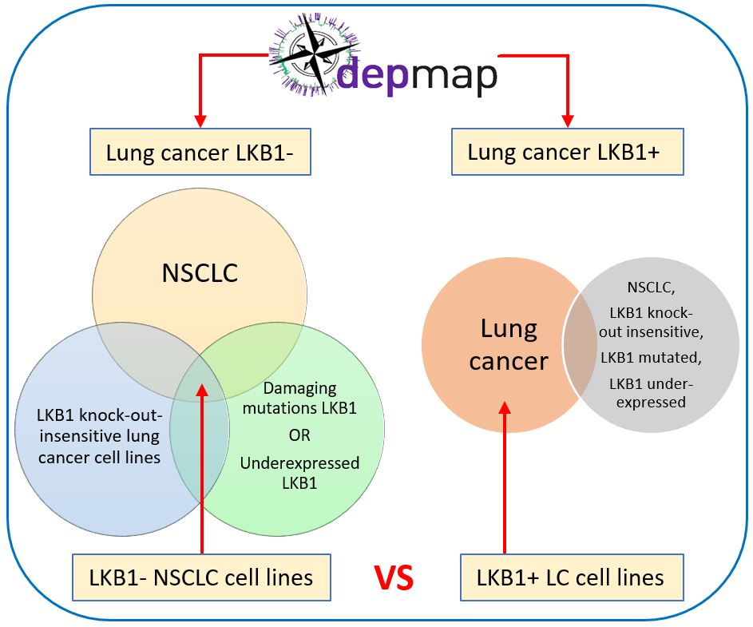
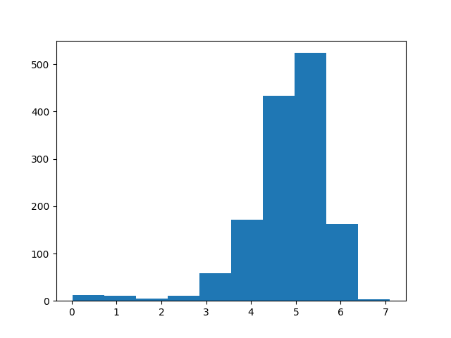
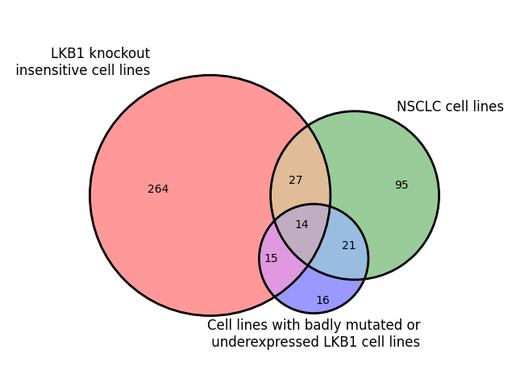
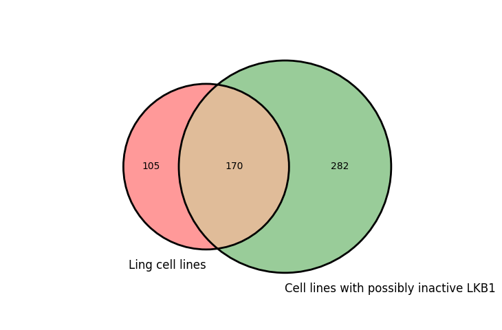
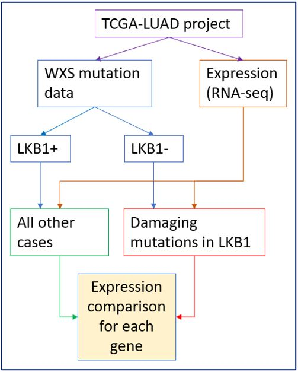
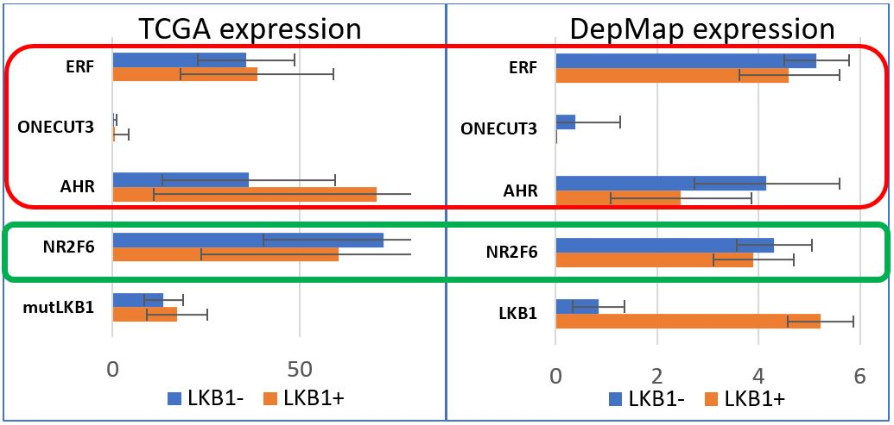
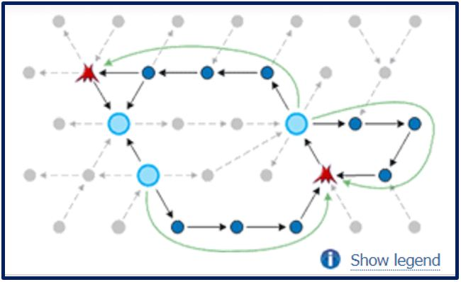
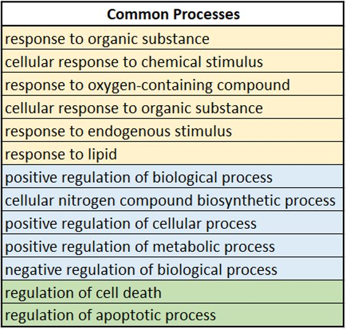

# Potential cancer dependencies in the context of LKB1 loss in non-small cell lung cancer (NSCLC)

_Author:_ Kikalova Tatiana<br>
_Supervisor:_ Holik Aliaksei

<a name="anchor_0"></a>
## Table of Contents
1. [Requirements](#anchor_1)
2. [Introduction](#anchor_2)
3. [Goals](#anchor_3)
4. [Phase 1: Analysis of data on cancer cell lines from the DepMap project](#anchor_4)
    1. [Data](#anchor_4_1)
    1. [Workflow](#anchor_4_2)
    1. [Execution](#anchor_4_3)
    1. [Results](#anchor_4_4)
5. [Phase 2: Analysis of clinical data from the TCGA database](#anchor_5)
    1. [Data](#anchor_5_1)
    1. [Workflow](#anchor_5_2)
    1. [Execution](#anchor_5_3)
    1. [Results](#anchor_5_4)
6. [Phase 3: Analysis and interpretation of the Phase 1 and 2 results](#anchor_6)
    1. [Literature analysis](#anchor_6_1)
    1. [Network reconstruction](#anchor_6_2)
    1. [GO enrichment](#anchor_6_3)
7. [Final conclusion](#anchor_7)
8. [References](#anchor_8)


<a name="anchor_1"></a>
## 1. Requirements [↑](#anchor_0)

Minimum hardware requirements:
- CPU Intel Core i3 or higher version
- RAM 4 GB
- Free storage space 6 GB

Tested with hardware:
- CPU Intel Core i7
- RAM 32 GB
- Free storage space 30 GB

Code was tested on Ubuntu 20.04 (`dash 0.5.10`) / Windows 10 (`cmd.exe`), Python 3.9.
Python necessary modules are listed in `requirements.txt` file. To install them you need to run the next command:
```
pip install -r requirements.txt
```
If you see error message like `Building wheel for wget (setup.py) ... error`
please ignore it.

Also you need:
1. `curl` (tested on version 7.68.0)
2. `tar` (tested on version 1.30)

<a name="anchor_2"></a>
## 2. Introduction [↑](#anchor_0)

Non-small-cell lung carcinoma (NSCLC) is any type of epithelial lung cancer other than small-cell lung carcinoma.
NSCLC accounts for about 85% of all lung cancers and is known to be relatively insensitive to chemotherapy,
comparing to small-cell carcinoma \[[PMID: 15255162](https://pubmed.ncbi.nlm.nih.gov/15255162/)\],
\[[PMID: 18452692](https://pubmed.ncbi.nlm.nih.gov/18452692/)\].
NSCLC develops multiple approaches to avoid apoptosis and gain chemoresistance, that makes the treatment
more challenging \[[PMID: 20951465](https://pubmed.ncbi.nlm.nih.gov/20951465/)\].
But despite broad interest and various research of this area, the progress with identifying the effective
treatment is still limited.

One of the characteristics of NSCLC is a loss of the tumor-suppressor kinase LKB1 (liver kinase B1).
LKB1 is known for its ability to induce apoptosis, regulate cell polarity and differentiation and
suppress the growth, invasion, and metastases of tumor cells
\[[PMID: 33572782](https://pubmed.ncbi.nlm.nih.gov/33572782/)\],
\[[PMID: 34524570](https://pubmed.ncbi.nlm.nih.gov/34524570/)\].
Although the inhibition of tumor-suppressors, such as LKB1, gives an advantage in avoiding the apoptosis,
is also affects the normal pathways and thus the tumor cells have to rely on alternative means
(ways) of survival.

This gives us an opportunity to identify effective targets in these alternative pathways that
we can inhibit and by this affect only tumor cells without damaging normal tissues
\[[PMID: 27032828](https://pubmed.ncbi.nlm.nih.gov/27032828/)\]. 

In this project we used open-source data from multiple sources: 
- cancer sensitivity data to genetic targeting (shRNA and CRISPR) in cancer cell lines from the [Cancer Dependency Map (DepMap)](https://depmap.org/portal/);
- gene expression and mutation data for NSCLC patient cohorts from [The Cancer Genome Atlas (TCGA)](https://www.cancer.gov/about-nci/organization/ccg/research/structural-genomics/tcga).

<a name="anchor_3"></a>
## 3. Goals [↑](#anchor_0)

1. Identify genes in alternative pathways of cancer survival in condition LKB1 loss
2. Analyze identified genes for their safety and success as potential drug target candidates

<a name="anchor_4"></a>
## 4. Phase 1: Analysis of data on cancer cell lines from the DepMap project [↑](#anchor_0)

<a name="anchor_4_1"></a>
### 4.1. Data [↑](#anchor_0)

DepMap contains research results from more than 1800 cancer cell lines. In our work, we used data on the survival of cell lines under conditions of knockout of various genes, mutation and expression data:

- **Genome-scale catalog of genetic vulnerabilities** - genome-wide screening for the sensitivity of cancer cell lines to the suppression or knockout of individual genes. The file "CRISPR_gene_effect.csv" contains a survival estimate. A negative value implies growth inhibition or/and death of the cell line due to knockout of individual genes. The use of CRISPR technology itself carries a toxic effect on cells, so the researchers provided information on the significance of the effect of knockout on survival in order to separate the negative effects of the toxic effects of knockout from CRISPR. This information is in the "CRISPR_gene_dependency.csv" file.

- **Expression data** of protein-coding genes was taken from the file "CCLE_expression.csv", Cancer Cell Line Encyclopedia (CCLE).

- **Data on mutations**, identified on the studied cell lines, can be found in the file "CCLE_mutations.csv".
- **Cell lines annotation** was taken from the file "sample_info.csv".

<a name="anchor_4_2"></a>
### 4.2. Workflow [↑](#anchor_0)

In order to find potential candidate genes, we compared two sets of cell lines with (LKB1+) and without (LKB1-) functional LKB1:
<br>
  **Figure 1.** General workflow schematics

<a name="anchor_4_2_1"></a>
#### 4.2.1. Determining the list of cell lines with lost or broken LKB1 (LKB1-) [↑](#anchor_0)

Cell line selection criteria:

- In **Figure 2**, it can be noted that most of the cell lines express LKB1 with a value > 3. However, there is a clearly distinguishable group of cell lines expressing LKB1 below this threshold. This group was taken into further analysis as a group of cell lines that lost LKB1 (from the CCLE_expression.csv file).
<br>
  **Figure 2.** LKB1 expression distribution

- Cell lines were selected by two parameters: **lineage_subtype** = "NSCLC" in the file "sample_info.csv" and **Variant_annotation** = "damaging" in the file "CCLE_mutations.csv". This allowed us to isolate a group of NSCLC cell lines with mutated LKB1.

- Cell lines insensitive to LKB1 knockout were taken from the file "CRISPR_gene_effect.csv", where the value of **Gene Effect** > 0, which means that growth of the cell population is positive after knockout of LKB1.

- We then took cell lines that met three conditions: NSCLC cell lines, cell lines insensitive to LKB1 knockout, and cell lines with mutant or low-expressed LKB1.
<br>
  **Figure 3.** LKB1- cell lines

- In total, we received 14 cell lines that meet the listed conditions.

<a name="anchor_4_2_2"></a>
#### 4.2.2. Determining the list of cell lines with functional LKB1 (LKB1+) [↑](#anchor_0)

All lung cancer cell lines were taken as functional LKB1 cell lines, with the exception of lines satisfying at least one of the following conditions:

- cell lines with lineage_subtype = "NSCLC" in the file "sample_info.csv"
- cell lines insensitive to LKB1 knockout
- cell lines with mutant or low-expressed LKB1
<br>
  **Figure 4.** LKB1+ cell lines
- In total, we obtained 105 cell lines with functional LKB1.

Thus, according to the results of points 1 and 2, we received two lists of cell lines for comparison:

#### 4.2.3. Determination of candidate genes by comparing information for each gene in two selected groups of cell lines [↑](#anchor_0)

For each gene, the following comparison was made:
- Cell lines containing damaging mutations in LKB1 were excluded from the comparison.
- To compare the expression of each gene between sets of cell lines, Student's t-test (ttest_ind function from the `scipy.stats` package) was used, p-value < 0.05.
- Due to the fact that CRISPR technology itself carries a toxic effect, the knockout sensitivity (survival-negative cell lines only) of each gene in cell lines lacking functional LKB1 (LKB1-) was further filtered using the gene dependency likelihood score = 0.2 (file "CRISPR_gene_dependency.csv").
- To compare survival between sets of cell lines, Student's t-test (function ttest_ind from the `scipy.stats` package) was used, p-value < 0.05.
- LKB1- cell lines with mean survival value < 0 in condition of this gene knockout,were taken into comparison.
- LKB1+ cell lines with mean survival value > 0 in condition of this gene knockout,were taken into comparison.

Genes that meet the following criteria were identified as **candidate genes**:
- Absence of damaging mutations in this gene;
- Statistically significant increase in the expression of this gene in LKB1- cell lines;
- Statistically significant decrease in survival with knockout of this gene in LKB1- cell lines;
- Negative mean survival with knockout of this gene in LKB1- cell lines;
- Positive mean survival with this gene knockout in LKB1+ cell lines;
- The value of dependency likelihood score is above the threshold of 0.2 for this gene in LKB1- cell lines.

<a name="anchor_4_3"></a>
### 4.3. Execution [↑](#anchor_0)

#### 4.3.1. Download required files from [DepMap Public **22Q1**](https://depmap.org/portal/download/all/):
```
python phase1_download_csv_data.py
```
Downloaded files will be located in `./phase1/csv_data/` folder:
- CRISPR_gene_effect.csv
- CRISPR_gene_dependency.csv
- CCLE_expression.csv
- CCLE_mutations.csv
- sample_info.csv

#### 4.3.2. Run Phase 1 analysis on DepMap data:
```
python phase1_depmap_analysis.py
```
The result of Phase 1 you can see at the end of the console output.

<a name="anchor_4_4"></a>
### 4.4. Results [↑](#anchor_0)

As a result of the first phase, **4 candidate genes were isolated**:
1. **ONECUT3** (EntrezGene ID: 390874)
2. **AHR** (EntrezGene ID: 196)
3. **ERF** (EntrezGene ID: 2077)
4. **NR2F6** (EntrezGene ID: 2063)

<a name="anchor_5"></a>
## 5. Phase 2: Analysis of clinical data from the TCGA database [↑](#anchor_0)

The Cancer Genome Atlas (TCGA), a landmark cancer genomics program, molecularly characterized over 20,000 primary cancer and matched normal samples spanning 33 cancer types. TCGA data can be accessed through the [National Cancer Institute (NCI)'s Genomic Data Commons (GDC) portal](https://portal.gdc.cancer.gov/).

In this phase we analyzed clinical data from cancer patients to confirm our results from the Phase 1 of the project.
<a name="anchor_5_1"></a>
### 5.1. Data [↑](#anchor_0)

The clinical data related to Lung cancer was pulled from the
[TCGA-LUAD project](https://portal.gdc.cancer.gov/projects/TCGA-LUAD)
for Lung adenocarcinoma.

Two data types were taken into the analysis:
- full exome sequencing (WXS) data located in multiple files in “maf” format
- expression (RNA-seq) data located in multiple files in “tsv” format

<a name="anchor_5_2"></a>
### 5.2. Workflow [↑](#anchor_0)

The information about LKB1 mutations was collected from the WXS data.
All case IDs for the cases with the LKB1 mutation status “not silent” (“Variant classification” column) were gathered. These case IDs were used to split expression data into two cohorts:
1. Cases with the damaging mutations in LKB1 (from the WXS data) were identified as LKB1- group
2. All other cases in the TCGA-LUAD project were identified as LKB1+ group<br>
The TCGA data that we used for the analysis was already normalized using the
[TPM (transcripts per million) calculation method](https://docs.gdc.cancer.gov/Data/Bioinformatics_Pipelines/Expression_mRNA_Pipeline/#tpm).
Expression of gene-candidates, that were identified in the Phase 1 of the project (DepMap data analysis), in these two cohorts was compared using [Student’s t-test](https://docs.scipy.org/doc/scipy/reference/generated/scipy.stats.ttest_ind.html) (p-value < 0.05).
To identify the processes that were changed due to the LKB1 loss, we screened expression of genes that statistically significantly (p-value < 0.05) increased expression in condition of LKB1 loss.
<br>
  **Figure 5.** General workflow schematics

<a name="anchor_5_3"></a>
### 5.3. Execution [↑](#anchor_0)<br>

#### 5.3.1. Download expression files for **Phase 2**:
```
python phase2_tcga_prep_curl_expr.py
```
then run cURL with parameters:
```
curl --output phase2/expression_files.tar.gz --remote-name --remote-header-name --request POST --header "Content-Type: application/json" --data @phase2/request_tsv.txt "https://api.gdc.cancer.gov/data"
```

#### 5.3.2. Extract the downloaded expression archive into `TCGA/` folder:
TCGA folder should contain all the \*.tsv files (598 files). Fot this run:
```
tar xf phase2/expression_files.tar.gz --directory phase2/TCGA
```
#### 5.3.3. Run processing of the \*.tsv files:
```
python phase2_tcga_read_tsv.py
```
As result we will have combined dataframe in file
`phase2/TCGA_expressions_tpm.p`.
#### 5.3.4. Download mutation files for **Phase 2**:
```
python phase2_tcga_prep_curl_mut.py
```
and then run cURL with parameters:
```
curl --output phase2/mutation_files.tar.gz --remote-name --remote-header-name --request POST --header "Content-Type: application/json" --data @phase2/request_maf.txt "https://api.gdc.cancer.gov/data"
```

#### 5.3.5. Extract all the nested archives from the downloaded mutation archive:
Extract into the `TCGA_MAF/` folder. TCGA_MAF folder should contain all the \*.maf
files (448 files).
```
tar xf phase2/mutation_files.tar.gz --directory phase2/TCGA_MAF
```

#### 5.3.6. Run processing of \*.maf files:
```
python phase2_tcga_read_maf.py
```
As result, we will have combined dataframe in `file phase2/TCGA_maf.p`.

#### 5.3.7. Run analysis:
```
python phase2_tcga_analysis.py
```
Result of the analysis you can see at the end of console output.

<a name="anchor_5_4"></a>
### 5.4. Results [↑](#anchor_0)

As a result of the expression comparison, one of the gene-candidates was successfully confirmed (**NR2F6**). The expression of this gene was increased by the value of 11.86 TPM (**Figure 6**). This value (11 TPM) was used to identify the differentially expressed genes (in total **548 DEGs**) in the condition of LKB1 loss (Student's t-test with p-value < 0.05).

**Figure 6.** Comparison of TCGA and DepMap expression in cases with LKB1- vs LKB1+

<a name="anchor_6"></a>
## 6. Phase 3: Analysis and interpretation of the Phase 1 and 2 results [↑](#anchor_0)

The goal of the **Phase 3** was to deeply analyze the results of the first two phases of the project using literature search and scientific databases.
To identify the molecular pathways that were affected by the loss of LKB1 in NSCLC, we performed, firstly, network reconstruction and enrichment analysis and, secondly, intersected the results of enrichment analysis for DEGs and common downstream targets.

<a name="anchor_6_1"></a>
### 6.1. Literature analysis [↑](#anchor_0)

For the successful candidate gene **NR2F6** the literature search was done using the
[PubMed](https://pubmed.ncbi.nlm.nih.gov/) and [Google Scholar](https://scholar.google.es/)
search engines.
We found multiple publications confirming **NR2F6** as a novel therapeutic target
for lung adenocarcinoma treatment. The inhibition of **NR2F6** was shown to suppress
proliferation, migration and invasion of lung adenocarcinoma
\[[PMID: 31168689](https://pubmed.ncbi.nlm.nih.gov/31168689/)\],
\[[PMID: 34073258](https://pubmed.ncbi.nlm.nih.gov/34073258/)\].

Despite the fact that other candidate genes in our work were not confirmed by clinical
data, there are multiple studies showing a significant role of the **AHR**
\[[PMID: 17200336](https://pubmed.ncbi.nlm.nih.gov/17200336/)\],
\[[PMID: 22273977](https://pubmed.ncbi.nlm.nih.gov/22273977/)\]
and **ERF**  \[[PMID: 20978205](https://pubmed.ncbi.nlm.nih.gov/20978205/)\],
 \[[PMID: 33987392](https://pubmed.ncbi.nlm.nih.gov/33987392/)\] genes in the development of lung adenocarcinoma.

<a name="anchor_6_2"></a>
### 6.2. Network reconstruction [↑](#anchor_0)

To identify common downstream interactors between LKB1 and successfully confirmed candidate gene **NR2F6**, we used [**MetaCore™**](https://clarivate.com/products/biopharma/discovery-clinical-regulatory/early-research-intelligence-solutions/) network generation toolkit.
The self-regulation building algorithm finds the shortest directed paths containing transcription factors between the selected objects:

<br>
**Figure 7.** MetaCore™ network algorithm

There are **61 genes** that are commonly indirectly regulated by both **LBK1** and **NR2F6**:

<br>
**Figure 8.** LKB1 and NR2F6 common downstream targets

<a name="anchor_6_3"></a>
### 6.3. GO enrichment [↑](#anchor_0)

We can assume two possible reasons for the gene overexpression in the condition of LKB1 loss:
- Compensation of the lost LKB1 pathways 
- Loss of the LKB1-induced downregulation of these genes

To segregate these two groups, we made several steps:
- applied [Gene Ontology (GO)](http://geneontology.org/docs/go-annotations/) processes enrichment on 548 **DEGs** from **Phase 2** results
- applied GO processes enrichment on the common downstream targets of **LKB1** and candidate gene **NR2F6**
- then we intersected the **top 100 processes** from both enrichments

As the result, we got **13 GO processes** that can be grouped into 3 logical groups of parental processes, related to: cellular responses to some stimuli, regulation of cell metabolism and regulation of apoptosis/cell death.

<br>
**Figure 9.** Commonly regulated processes

Thus, we have found processes that are affected by the loss of LKB1 and are compensated by an increase in the expression of replacer genes.

<a name="anchor_7"></a>
## 7. Final conclusion [↑](#anchor_0)
In conclusion, we can say that:
- all the goals of the project were successfully achieved
- we recommend confirmed NR2F6 candidate gene for further research as a drug target for non-small cell lung cancer
- the identified commonly regulated processes should be taken into consideration during the future Drug toxicity research and compensatory therapy development.

<a name="anchor_8"></a>
## 8. References [↑](#anchor_0)
1. Ettinger DS. Overview and state of the art in the management of lung cancer. Oncology (Williston Park). 2004 Jun;18(7 Suppl 4):3-9. \[[PMID: 15255162](https://pubmed.ncbi.nlm.nih.gov/15255162/)\]
2. Molina JR, Yang P, Cassivi SD, Schild SE, Adjei AA. Non-small cell lung cancer: epidemiology, risk factors, treatment, and survivorship. Mayo Clin Proc. 2008 May;83(5):584-94. doi: 10.4065/83.5.584. \[[PMID: 18452692](https://pubmed.ncbi.nlm.nih.gov/18452692/)\]
3. Chang A. Chemotherapy, chemoresistance and the changing treatment landscape for NSCLC. Lung Cancer. 2011 Jan;71(1):3-10. doi: 10.1016/j.lungcan.2010.08.022. Epub 2010 Oct 16. \[[PMID: 20951465](https://pubmed.ncbi.nlm.nih.gov/20951465/)\]
4. Mograbi B, Heeke S, Hofman P. The Importance of STK11/LKB1 Assessment in Non-Small Cell Lung Carcinomas. Diagnostics (Basel). 2021 Jan 29;11(2):196. doi: 10.3390/diagnostics11020196. \[[PMID: 33572782](https://pubmed.ncbi.nlm.nih.gov/33572782/)\]
5. Mazzaschi G, Leonetti A, Minari R, Gnetti L, Quaini F, Tiseo M, Facchinetti F. Modulating Tumor Microenvironment: A Review on STK11 Immune Properties and Predictive vs Prognostic Role for Non-small-cell Lung Cancer Immunotherapy. Curr Treat Options Oncol. 2021 Sep 15;22(11):96. doi: 10.1007/s11864-021-00891-8. \[[PMID: 34524570](https://pubmed.ncbi.nlm.nih.gov/34524570/)\]
6. Nawaz K, Webster RM. The non-small-cell lung cancer drug market. Nat Rev Drug Discov. 2016 Apr;15(4):229-30. doi: 10.1038/nrd.2016.42. \[[PMID: 27032828](https://pubmed.ncbi.nlm.nih.gov/27032828/)\]
7. Jin C, Xiao L, Zhou Z, Zhu Y, Tian G, Ren S. MiR-142-3p suppresses the proliferation, migration and invasion through inhibition of NR2F6 in lung adenocarcinoma. Hum Cell. 2019 Oct;32(4):437-446. doi: 10.1007/s13577-019-00258-0. Epub 2019 Jun 5. \[[PMID: 31168689](https://pubmed.ncbi.nlm.nih.gov/31168689/)\]
8. Klepsch V, Siegmund K, Baier G. Emerging Next-Generation Target for Cancer Immunotherapy Research: The Orphan Nuclear Receptor NR2F6. Cancers (Basel). 2021 May 26;13(11):2600. doi: 10.3390/cancers13112600. \[[PMID: 34073258](https://pubmed.ncbi.nlm.nih.gov/34073258/)\]
9. Chang JT, Chang H, Chen PH, Lin SL, Lin P. Requirement of aryl hydrocarbon receptor overexpression for CYP1B1 up-regulation and cell growth in human lung adenocarcinomas. Clin Cancer Res. 2007 Jan 1;13(1):38-45. doi: 10.1158/1078-0432.CCR-06-1166. \[[PMID: 17200336](https://pubmed.ncbi.nlm.nih.gov/17200336/)\]
10. Cheng YH, Huang SC, Lin CJ, Cheng LC, Li LA. Aryl hydrocarbon receptor protects lung adenocarcinoma cells against cigarette sidestream smoke particulates-induced oxidative stress. Toxicol Appl Pharmacol. 2012 Mar 15;259(3):293-301. doi: 10.1016/j.taap.2012.01.005. Epub 2012 Jan 16. \[[PMID: 22273977](https://pubmed.ncbi.nlm.nih.gov/22273977/)\]
11. Chou YT, Lin HH, Lien YC, Wang YH, Hong CF, Kao YR, Lin SC, Chang YC, Lin SY, Chen SJ, Chen HC, Yeh SD, Wu CW. EGFR promotes lung tumorigenesis by activating miR-7 through a Ras/ERK/Myc pathway that targets the Ets2 transcriptional repressor ERF. Cancer Res. 2010 Nov 1;70(21):8822-31. doi: 10.1158/0008-5472.CAN-10-0638. Epub 2010 Oct 26. \[[PMID: 20978205](https://pubmed.ncbi.nlm.nih.gov/20978205/)\]
12. Liu Z, Zheng M, Lei B, Zhou Z, Huang Y, Li W, Chen Q, Li P, Deng Y. Whole-exome sequencing identifies somatic mutations associated with lung cancer metastasis to the brain. Ann Transl Med. 2021 Apr;9(8):694. doi: 10.21037/atm-21-1555. \[[PMID: 33987392](https://pubmed.ncbi.nlm.nih.gov/33987392/)\]

